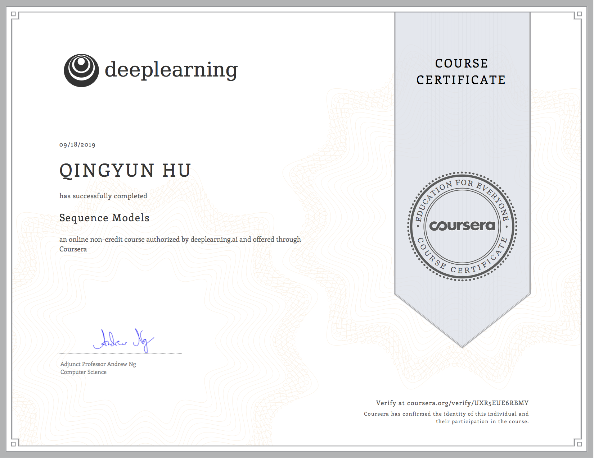

# Sequence-Model
This is my (Qingyun Hu's) submission of Sequence Model assignment from deep.ai/Coursera.

You are welcomed to refer to this submission if you are stucked somewhere. But please note that submitting work that isn't your own may result in permanent failure of this course or deactivation of your Coursera account.

# A Quick Walk-Through

## [Building a Recurrent Neural Network - Step by Step](./1_Building_a_Recurrent_Neural_Network_Step_by_Step/Building_a_Recurrent_Neural_Network_Step_by_Step_v3.ipynb)

**Task:**

1. Build an RNN using Numpy. 
2. Build an LSTM using Numpy. 

**Your take-away:**

You will get familiar with how RNN/LSTM cell is constructed and passed from one iteration to the next in detail. You will also get better at numpy.matrix manipulation.

## [Dinosaurus_Island_Character_level_language_model_final_v3.ipynb](./2_Dinosaur_Island--Character-level_language_model/Dinosaurus_Island_Character_level_language_model_final_v3.ipynb)

**Task:**

1. Given a list of Dinosaurs' name, train a RNN model to understand how dinosaurs name themselves, then create new names for dinasaurs via the trained RNN model. 

**Your take-away:**

Apart from building an RNN model with Numpy again, you will also take care of the input and output. Say, How to map an character into a one-hot vector, and vice-versa. Ah, you will also need to deal with gradient explosion by clipping the gradient at each time stamp. This is obviously an one-to-one model, beware that at each step the prediction is affected by all previous inputs, and that the input at each step is not the output from last step, instead, you sample an new one-hot-vector(representing a character in this case) according to this output(probability distribution).

## [Jazz_Improvisation_With_LSTM](./3_Jazz_Improvisation_With_LSTM/Improvise_a_Jazz_Solo_with_an_LSTM_Network_v3.ipynb)

**Task:**

1. Build a LSTM model with Keras, train this model with jazz solo by some Jazz master, then use this model to improvise a Jazz solo. 

**Your take-away:**

Get familiar with how to build and train an Sequence (here, LSTM) model with Keras. 

## [Word_Vector_Representation](./4_Word_Vector_Representation/Operations_on_word_vectors_v2.ipynb)

**Task:**

1. Using pre-trained set of word vectors, implemente cosine similarity to find word analogy.

**Your take-away:**

1. Get to know how to compute similarity between pairs of word vectors. 
2. Get to see how word vector representation works.

## [Emojify](./5_Emojify/Emojify_v2.ipynb)

**Task:**
1. Using the same pre-traind set of word vectors to tackle a task: Given a list of sentences, assign an emoji from [❤️, ⚾️, 😄, 😞, 🍴] to each sentence.
2. Method:
* Using numpy to implement an fully-connected Neural Network then updating parameters with Stochastic Gradient Descent. Here the input is an average of word vector representations in each sentences.
* Using Keras to build an 2-layer LSTM sequence classifier, here the input at each step is a word vector from this sentence.

**Your take-away:**
1. Here you get to build a more complecated model, and see how sequence model beats simply averaging the word vectors as an input.
2. More detailed tricks like coping with different length of sentences by padding, using dropout layer to decrease over-fitting, etc.

## [Machine_Translation](./6_Machine_Translation/Neural_machine_translation_with_attention_v4.ipynb)

**Task:**
1. Transforming human readable date into machine readable date, by building a LSTM network with Attention mechanism (see figure 1).
<table>
<td> 
  
</td> 
<td> 
  
</td> 
</table>
<caption>
 **Figure 1**: Neural machine translation with attention
</caption>

**Your take-away:**

Here you get to know how is attension weights computed how to build a bi-directional LSTM, and how tensors passed from one layer to the other.

## My Certificate
This part if for my future employers only.

